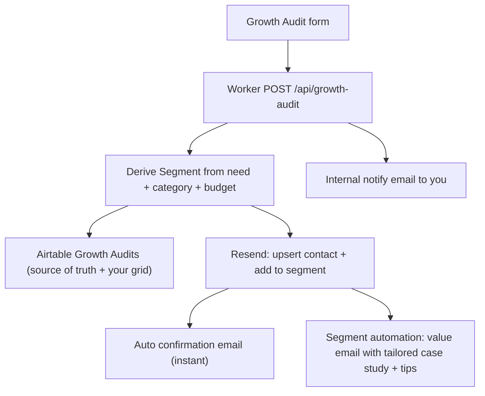

# SWFT Studios — Messaging + Frictionless Funnel + Auto-Segmentation Plan

Builds on the Growth Audit funnel already on `cursor/swft-conversion-funnel-4378`.
Goal: sharpen the elevator pitch, make the landing page flow with zero friction,
and turn a form submission into an automatic, *segment-specific* value response.

---

## 1. The elevator pitch

**Your words:** "SWFT Studios — end-to-end marketing with scroll-stopping video, photo, and conversion-focused websites."

**Refined one-liner (site voice):**
> SWFT Studios is an end-to-end marketing studio. We create scroll-stopping video and photo content and build conversion-focused websites — so your brand earns attention and turns it into customers.

**Why this works:** it names *what* (video, photo, websites), the *feeling* (scroll-stopping), and the *result* (turns attention into customers) in one breath. "End-to-end" removes the "do I need three vendors?" objection.

### Hero copy (chosen default)

- **Eyebrow:** `End-to-End Marketing Studio · NYC · Jersey City · North Jersey`
- **Headline:** `Scroll-stopping content. Websites that convert.`
- **Subhead:** `SWFT Studios creates scroll-stopping video and photo and builds conversion-focused websites — so your brand earns attention and turns it into booked customers, without juggling multiple agencies.`
- **Primary CTA:** `Get Your Free Growth Audit`
- **Secondary CTA:** `View Our Work`
- **Microcopy under buttons:** `Send your site or socials — get 3 specific ways to turn more attention into customers.`

Alternate headlines to pick from:
1. `End-to-end marketing that stops the scroll — and books the customer.`
2. `Video, photo, and websites that turn attention into customers.`
3. `We make the content that stops the scroll and the site that closes the sale.`

---

## 2. The three-pillar story (one system, not a menu)

Frame the services as a single loop so there's no "which do I pick?" friction:

> Content earns the attention. The website converts it. Follow-up closes it.

1. **Scroll-Stopping Video** — reels, ads, and brand films built to stop the scroll and get watched.
2. **Standout Photo** — product, brand, and location photography that finally matches the quality of your work.
3. **Conversion-Focused Websites** — sites engineered to turn that attention into inquiries and bookings.

Each pillar ends with the *same* CTA: `Get Your Free Growth Audit` (no competing actions).

---

## 3. Frictionless landing page flow

Principles: one promise, one primary action per screen, proof early, minimum form fields, instant acknowledgement.

| # | Section | Job | Friction removed |
|---|---|---|---|
| 1 | Hero | State the pitch + single CTA | No competing buttons |
| 2 | Proof strip | Client work marquee / logos immediately | Builds trust before the ask |
| 3 | What I do | Three pillars as one system | Kills "which service?" hesitation |
| 4 | Attention → Customer | The problem/outcome in one line | Makes the value obvious |
| 5 | Featured work | Video-forward examples | Shows, doesn't tell |
| 6 | Simple process | Submit → Audit → Plan → Launch | Removes "what happens if I reach out?" fear |
| 7 | Growth Audit CTA + short form | The conversion moment | Short form, see §4 |
| 8 | FAQ | Handle last objections | Reduces abandonment |
| 9 | Footer | Quiet, single CTA | No dead ends |

### Form friction reduction

- **Step 1 (visible immediately):** First name, Email, Website or social, "What do you need?" (segment picker). That's it — 4 fields to submit.
- **Optional expandable block:** phone, business name, budget, timeline, context (progressive disclosure — not required to submit).
- Inline validation, honeypot, accessible errors (already built).
- On submit → instant redirect to thank-you **and** an automatic email lands in their inbox within seconds (see §4). The "I got an instant reply" moment is the biggest trust lever.

---

## 4. Submission → Airtable → auto-segment → auto-value

### 4a. Segmentation logic (deterministic, computed in the Worker)

The Worker maps the visitor's stated need into one **Segment** before storing/tagging, so Airtable and Resend always agree.

| Visitor need (challenge) | Segment | Auto-delivered value |
|---|---|---|
| Website not generating inquiries / needs a new website | `Website` | Website case study (Brooklyn Steel) + 3 quick website wins |
| Content doesn't reflect quality / need better photos or videos | `Content` | Video/photo case study (Roller Reels, Blurred Lines) + content examples |
| Need a clearer brand and offer | `Brand` | Positioning/offer mini-guide + example |
| Need a better lead follow-up system | `Systems` | Lead-system explainer + example flow |
| Other | `General` | Overview + invitation to reply with specifics |

Modifiers: `Business Category` refines tone; `Budget $5,000+` or `ASAP` flags a **Priority** tag so you can reply personally fast.

### 4b. Airtable (storage + CRM view)

- Keep the existing `Growth Audits` table as the source of truth and your working grid.
- Add fields: `Segment`, `Priority` (checkbox), `Auto-Reply Sent` (checkbox/date).
- You still see every lead in one place and can override the segment manually.

### 4c. Automatic emails — provider decision

**Recommended: Resend** (MCP is already connected in this workspace and supports contacts, segments, and event-triggered automations).

- Worker sends the **instant confirmation** ("Got it — here's what happens next") via Resend transactional API.
- Worker upserts the person as a Resend **contact** and adds them to the matching **segment**.
- A Resend **automation** per segment delivers the tailored value email (immediately or after a short delay), and can branch by segment/priority.
- This is branded, reliable, and lets you edit the email content visually in the Resend dashboard later.

**Fallback: Airtable automations** (no code): "When record created → Send email." Simpler, less branded, no new secret. Good if you'd rather not add Resend yet.

**Setup required for Resend path:**
- Verified sending domain in Resend (e.g. `swftstudios.com`).
- `RESEND_API_KEY` set as a Worker secret (never committed).
- One Resend segment ID per Segment above (Website / Content / Brand / Systems / General).

---

## 5. What gets built (once you approve)

1. **Messaging swap** on `index.html` hero + three-pillar section + microcopy (reuses existing design system).
2. **Form field tweak** on `growth-audit.html`: promote a "What do you need?" picker to the top; move non-essentials into an optional block.
3. **Worker** `src/worker.ts`: compute `Segment`/`Priority`; keep Airtable write; add Resend contact-upsert + segment-add + confirmation send; internal notify.
4. **Resend** (via MCP): create/verify segments + build the per-segment value automations and email templates.
5. **Docs**: update `INTEGRATIONS.md` with the Resend setup + segment map; record env vars.

No new frameworks, no visual redesign, no fabricated metrics, no secrets in git.

---

## 6. Decisions I need from you

1. **Email provider:** Go with **Resend** (branded, automated, recommended) or **Airtable automations** (no-code, simpler)?
2. **Sending domain:** Is `swftstudios.com` (or which address) verified/available in Resend for sending? This gates the branded emails.
3. **Headline:** Keep the default `Scroll-stopping content. Websites that convert.` or pick one of the alternates in §1?

Once you confirm these three, I'll implement in the same release-style, commit per phase, and push to the PR.
